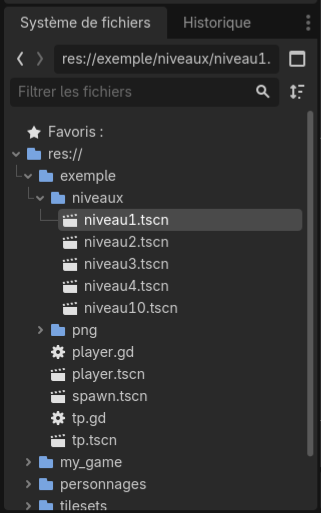
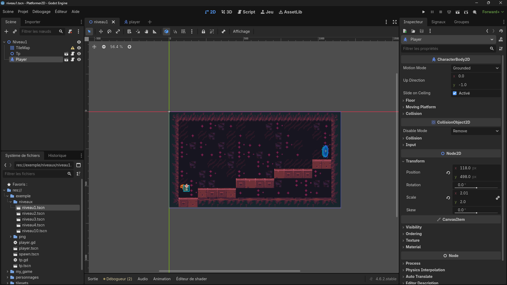
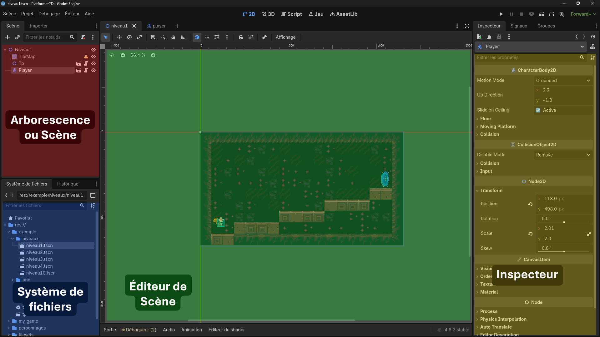
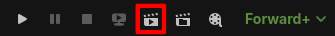
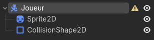
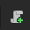
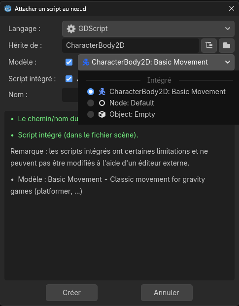
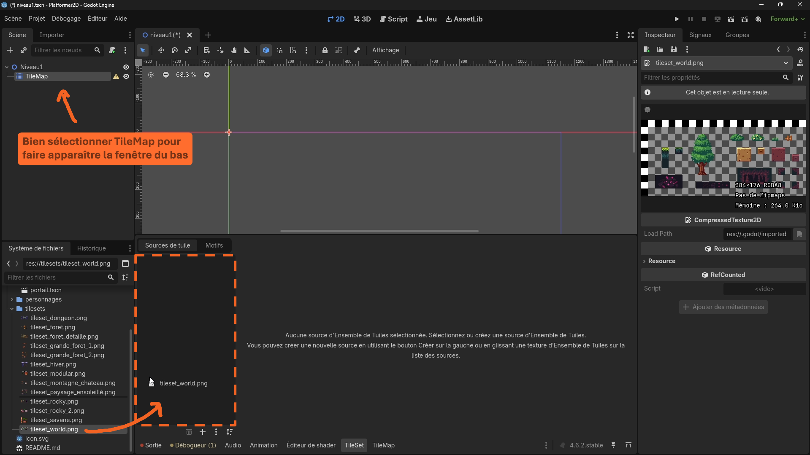
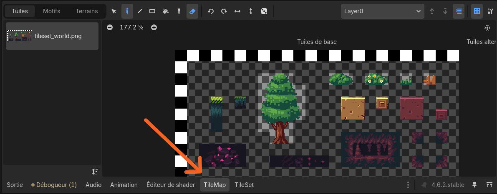

<!-- 
 
-->

# Cours : Création d'un Platformer en 2D avec Godot

## 1. Installation
Une fois **Godot** ouvert, importer le projet en cliquant sur le bouton `Importer`, sélectionner le dossier `Platformer2D_course`, double cliquer sur `project.godot` et valider en cliquant sur `importer`

(Autre méthode: cliquer sur scanner, choisir le dossier *Téléchargements* et valider).
Le projet devrait apparaître dans la fenêtre **Godot**.

## 2. Présentation de l'interface

- Ouvrir la scène `exemple/niveaux/niveau1.tscn` dans le `Système de Fichiers` :

---

Cette interface devrait apparaître :

 

## 3. Lancement de l'exemple

**Avec niveau1.tscn ouvert**, cliquer sur ce bouton : 

Le jeu doit se lancer dans une fenêtre à part. Appuyez sur les **flèches** pour bouger et sur **espace** pour sauter.

## 4. Création de son propre jeu

Les scènes pour la création du jeu sont dans le dossier `my_game/`

### Création du joueur

- Ouvrir la scène joueur.tscn, c'est la scène qui contiendra notre joueur : son image, ses collisions, son script de mouvements et actions.

 

- **Image** du personnage :
    - Ajouter un noeud de type `Sprite2D` (c'est le **noeud** qui permet d'afficher une image) 
    - Ajouter une texture dans l'inspecteur au niveau de `Texture <vide>` (Soit en cliquant sur `<vide>` -> Chargement Rapide -> [votre image] soit en glissant une image directement dans le rectangle `<vide>`)
    > **ℹ️** Pour rendre la texture nette : dans l'inspecteur du noeud `Sprite2D`, cliquer sur "Texture" et régler `Filter` sur `Nearest`.
    
    > **ℹ️** Le joueur est pour l'instant représenté par une image, il faut lui ajouter une boîte de collisions pour qu'il puisse intéragir avec son environnement

 
 

- **Collisions** du personnage :
    - Ajouter un noeud de type `CollisionShape2D` (c'est le noeud qui donne une zone de collision au personnage, pour qu'il ne traverse pas le sol !)
    - Lui donner une forme de rectangle en cliquant, dans l'inspecteur, sur `Shape <vide>`
    - Redimensionner le rectangle au format du personnage

    L'arborescence doit ressembler à celle ci : 

    Si ce n'est pas le cas, glisser les noeuds pour correspondre.
    > **ℹ️** Le joueur a une zone de collisions, quand il croisera un autre objet avec une zone de collision (un sol par exmple), les deux se bloqueront. Autrement dit, le joueur ne tombera pas à travers le sol.

 
 

- **Mouvements** du personnage :
    - Cliquer sur le noeud parent (nommé "Joueur") et attacher un script avec l'icône  ou en faisant `clic-droit -> Attacher un script`
    - Sélectionner le modèle de script `CharacterBody2D : Basic Movement` et `Créer`

        

    - Un script devrait être généré automatiquement.

- Tester le personnage, il devrait tomber dans le vide et bouger en appuyant sur les flèches

### Création d'un niveau

- Ouvrir la scène niveau1.tscn, c'est la scène qui contiendra notre premier niveau.

 

- **Installation** d'un "TileMap" :
    - Ajouter un noeud `TileMap` à la scène
    - Cliquer sur `Tile Set <vide>`dans l'inspecteur et sélectionner `TileSet`
    - Dans le `Système de Fichiers`, parcourir le dossier `tilesets/` et choisir un tileset que l'on apprécie (Il s'agit des briques qui serviront a construire notre niveau). Double cliquer sur un tileset l'affiche en grand dans l'inspecteur si besoin.
    - Glisser le tileset choisi dans la zone en pointillés (voir figure en dessous) et cliquer sur "Oui" pour découper le tileset intelligemment 

        

        > **ℹ️** Le TileMap est initialisé et découpé bloc par bloc. L'objectif est maintenant de l'utiliser pour construire notre niveau.

 
 

- **Manipulation** du TileMap :
    - Tout bas de l'interface, sélectionner l'onglet TileMap
    
        

        > **ℹ️** L'onglet TileMap permet de dessiner son niveau, tandis que l'onglet TileSet permet de modifier/améliorer ses blocs (en ajoutant des collisions par exemple)
    - Cliquer sur un bloc et dessiner sur l'éditeur de scène.
        > **ℹ️** Il est possible de sélectionner plusieurs blocs d'un coup pour dessiner des groupes (exemple : sélectionner un arbre entier). 
         Ne pas hésiter à utiliser les outils de ligne, zone, ... et de sélection pour déplacer des objets.
    - Pour changer la taille des blocs du niveau, ajuster le paramètre `Scale` dans l'inspecteur dans la section `Transform`. 
     Exemple : mettre le `Scale x/y` à 4.0 rendra le quadrillage 4x plus gros.
    > **ℹ️** Pour rendre la texture nette : dans l'inspecteur du noeud `TileMap`, cliquer sur "Texture" et régler `Filter` sur `Nearest`.

 

- Glisser le fichier `joueur.tscn` au milieu de la scène `niveau1.tscn`
    > **ℹ️** En lançant la simulation, le joueur devrait tomber à travers le niveau. Normal, les blocs du niveau n'ont pas de collisions.

 

- **Collisions des blocs** du TileMap
    - Cliquer sur le noeud TileMap pour faire apparaître l'inspecteur
    - **Dans l'inspecteur**, cliquer sur TileSet
    - Dérouler la section `Physics Layers` et cliquer sur `Ajouter un élément` (Cet élément va nous permettre d'ajouter des collisions à nos blocs)
    <!-- TODO : Bah la suite -->

### Ajout des téléporteurs entre niveaux

### Ajout d'ennemis

### Ajout de projectiles
