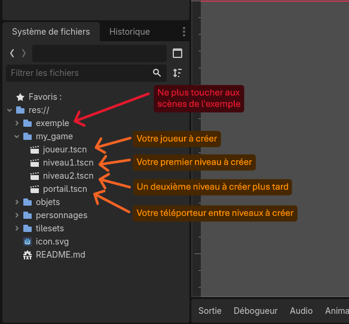
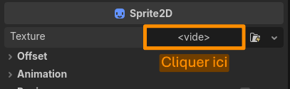
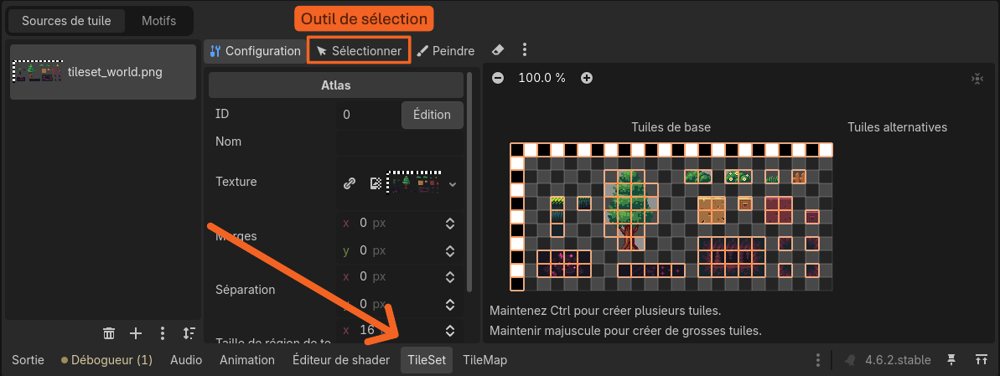
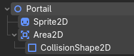

# Cours : Création d'un Platformer en 2D avec Godot

## 1. Installation
Une fois **Godot** ouvert, importer le projet en cliquant sur le bouton `Importer`, sélectionner le dossier `Platformer2D_course`, double-cliquer sur `project.godot` et valider en cliquant sur `Importer`

(Autre méthode : cliquer sur Scanner, choisir le dossier *Téléchargements* et valider).
Le projet devrait apparaître dans la fenêtre **Godot**.

## 2. Présentation de l'interface

- Ouvrir la scène `exemple/niveaux/niveau1.tscn` dans le `Système de Fichiers` :


---

Cette interface devrait apparaître :


<br>


## 3. Lancement de l'exemple

**Avec `niveau1.tscn` ouvert**, cliquer sur ce bouton : 

Le jeu doit se lancer dans une fenêtre à part. Appuyez sur les **flèches** pour bouger et sur **espace** pour sauter.

> **ℹ️** Il est aussi possible de cliquer sur `F6` pour lancer une scène

## 4. Création de son propre jeu

Les scènes pour la création du jeu sont dans le dossier `my_game/`



> **⚠️ CONSEIL POUR TOUT LE TP ⚠️** 
>
> Exécutez (avec `F6`) votre code à chaque jalon pour voir l'évolution de ce qui a été créé !
---
### Création du joueur

- Ouvrir la scène `joueur.tscn`, c'est la scène qui contiendra notre joueur : son image, ses collisions, son script de mouvements et actions.

<br>

- **Image** du personnage :
    - Ajouter un nœud de type `Sprite2D` (c'est le **nœud** qui permet d'afficher une image)
        > **ℹ️** Pour ajouter un nœud, faire clic-droit sur un noeud de l'aborescence, puis cliquer sur `ajouter un nœud enfant`
    - Ajouter une texture dans l'inspecteur au niveau de `Texture <vide>` (Soit en cliquant sur `<vide>` -> Chargement Rapide -> [votre image] soit en glissant une image directement dans le rectangle `<vide>`)

        

    <br>

    > **ℹ️** Pour rendre la texture nette : dans l'inspecteur du noeud `Sprite2D`, cliquer sur "Texture" et régler `Filter` sur `Nearest`.
    
    > **ℹ️** Le joueur est pour l'instant représenté par une image, il faut lui ajouter une boîte de collisions pour qu'il puisse interagir avec son environnement

<br>
<br>

- **Collisions** du personnage :
    - Ajouter un nœud de type `CollisionShape2D` (c'est le nœud qui donne une zone de collision au personnage, pour qu'il ne traverse pas le sol !)
    - Lui donner une forme de rectangle en cliquant, dans l'inspecteur, sur `Shape <vide>`
    - Redimensionner le rectangle au format du personnage

    L'arborescence doit ressembler à celle-ci : 

    Si ce n'est pas le cas, glisser les nœuds pour que l'arborescence corresponde.
    > **ℹ️** Le joueur a une zone de collision, quand il croisera un autre objet avec une zone de collision (un sol par exemple), les deux se bloqueront. Autrement dit, le joueur ne tombera pas à travers le sol.

<br>
<br>

- **Mouvements** du personnage :
    - Cliquer sur le nœud parent (nommé "Joueur") et attacher un script avec l'icône  ou en faisant `clic droit -> Attacher un script`
    - Sélectionner le modèle de script `CharacterBody2D : Basic Movement` et `Créer`

        

    - Un script devrait être généré automatiquement.

- Tester le personnage, il devrait tomber dans le vide et bouger en appuyant sur les flèches
---
### Création d'un niveau

- Ouvrir la scène `niveau1.tscn`, c'est la scène qui contiendra notre premier niveau.

<br>

- **Installation** d'un "TileMap" :
    - Ajouter un nœud `TileMap` à la scène
    - Cliquer sur `Tile Set <vide>` dans l'inspecteur et sélectionner `TileSet`
    - Dans le `Système de Fichiers`, parcourir le dossier `tilesets/` et choisir un tileset que l'on apprécie (Il s'agit des briques qui serviront à construire notre niveau). Double-cliquer sur un tileset l'affiche en grand dans l'inspecteur si besoin.
    - Glisser le tileset choisi dans la zone en pointillés (voir figure ci-dessous) et cliquer sur "Oui" pour découper le tileset intelligemment 

        

        > **ℹ️** Le TileMap est initialisé et découpé bloc par bloc. L'objectif est maintenant de l'utiliser pour construire notre niveau.

<br>
<br>

- **Manipulation** du TileMap :
    - Tout en bas de l'interface, sélectionner l'onglet TileMap
    
        

        > **ℹ️** L'onglet TileMap permet de dessiner son niveau, tandis que l'onglet TileSet permet de modifier/améliorer ses blocs (en ajoutant des collisions par exemple)
    - Cliquer sur un bloc et dessiner sur l'éditeur de scène.
        > **ℹ️** Il est possible de sélectionner plusieurs blocs d'un coup pour dessiner des groupes (exemple : sélectionner un arbre entier). 
        <br>Ne pas hésiter à utiliser les outils de ligne, zone, ... et de sélection pour déplacer des objets.
    - Pour changer la taille des blocs du niveau, ajuster le paramètre `Scale` dans l'inspecteur dans la section `Transform`. 
    <br>Exemple : mettre le `Scale x/y` à 4.0 rendra le quadrillage 4 fois plus gros.
    > **ℹ️** Pour rendre la texture nette : dans l'inspecteur du nœud `TileMap`, cliquer sur "Texture" et régler `Filter` sur `Nearest`.

<br>
<br>

- Depuis le `Système de Fichiers`, glisser le fichier `joueur.tscn` au milieu de la scène `niveau1.tscn`
    > **ℹ️** En lançant la simulation, le joueur devrait tomber à travers le niveau. Normal, les blocs du niveau n'ont pas de collisions.

<br>
<br>

- **Collisions des blocs** du TileMap
    - Cliquer sur le nœud TileMap pour faire apparaître l'inspecteur
    - **Dans l'inspecteur**, cliquer sur TileSet
    - Dérouler la section `Physics Layers` et cliquer sur `Ajouter un élément` (Cet élément va nous permettre d'ajouter des collisions à nos blocs)
    - Pour ajouter les collisions aux blocs, cliquer sur l'onglet TileSet en bas de l'écran
        
        
    
    - Avec l'outil `Sélectionner`, cliquer sur un des blocs auquel ajouter des collisions et ouvrir la section `Physique/Physic Layer 0` dans le panneau ayant apparu
    - Appuyer sur `F` pour ajouter la zone de collision (le bloc devrait devenir rouge)
        > **ℹ️** Pour chaque bloc nécessitant une collision, cliquer dessus et appuyer sur `F`

<br>

---
### Ajout des téléporteurs entre niveaux
- Ouvrir la scène `portail.tscn`, c'est la scène qui contiendra le téléporteur permettant de se téléporter d'un niveau à un autre.

- **Image** du téléporteur : 
    - Chercher une image d'objet dans le dossier `objets/`, ce sera l'objet à atteindre pour être téléporté
    - Comme pour le joueur, ajouter un `Sprite2D` et y glisser l'image choisie

<br>

- **Détection** du joueur :
    - Ajouter au nœud parent un nœud `Area2D` (C'est un nœud qui permet de détecter les collisions avec un autre objet pour effectuer une action. Ici, on va téléporter le joueur à un autre niveau quand il le touchera.)
    - Sur l'`Area2D`, ajouter un noeud `CollisionShape2D` et donner une zone de collision à l'objet.

        L'arborescence doit ressembler à celle-ci : 

    - Ouvrir la scène `niveau1.tscn` et glisser le fichier `portail.tscn` à l'endroit voulu. Tester avec (F6). Pour l'instant, le joueur passe à travers l'objet sans interaction, normal !
    - Retourner dans `portail.tscn` et suivre les étapes suivantes pour créer un signal entre le noeud `Area2D` et le changement de niveau (pour que lorsque l'on passe dans le `Area2D`, un signal soit envoyé pour téléporter le joueur) :
        - Clic droit sur le nœud `Portail` et attacher un script : décocher la case `Modèle` puis cliquer sur `Créer` (cela devrait créer un script presque vide)
        - Cliquer sur le noeud `Area2D`
        - Cliquer sur l'onglet `Signaux` tout en haut à droite de l'application
        - Clic-droit sur `body_entered(body:Node2D)` > `Connecter` > `Connecter`
        - Supprimer la ligne `pass # Replace with function body.`
        - À la place, mettre la ligne : 
        ```python
        get_tree().call_deferred("change_scene_to_file", "res://my_game/niveau1.tscn")
        ```
    - Tester en lançant le niveau 1 contenant le portail/objet !
        > **⚠️** Si le portail rentre en collision avec un bloc du niveau, il relancera le niveau en boucle (car il détecte uen collision !). Bien faire attention à ce que le téléporteur ne touche rien.
        
        > **ℹ️** Il faut comprendre ce que l'on a fait. Ici, nous avons créé un objet (portail.tscn) qui, une fois traversé par notre joueur, nous téléporte à une autre scène. Ici il nous téléporte à `niveau1.tscn`, donc on boucle sur le même niveau. Maintenant il faut créer un niveau 2 s'appelant `niveau2.tscn` et changer le code du portail pour qu'il nous téléporte au niveau 2 !

## C'est votre tour !

> **ℹ️** Ne pas hésiter à utiliser Internet et/ou ChatGPT à partir de maintenant pour voir les possibilités ! Ou le faire seul comme un pro.

**Idées diverses** (Les vôtres seront les meilleures) :

- Créez d'autres niveaux ! (Pensez à modifier le portail pour qu'il puisse téléporter à n'importe quel niveau)
- Améliorez vos niveaux en utilisant plusieurs couches de tileset (pour avoir un fond décor et un niveau au premier plan)
  
- Ajoutez une caméra fixe au personnage pour le suivre tout au long du niveau, permettant de faire des niveaux plus grands que de la taille d'un écran.
- Forcez le déplacement du joueur pour lui faire parcourir le niveau automatiquement (comme dans Geometry Dash 😉)
- Ajoutez des ennemis en créant une scène à part identique au joueur mais qui bouge toute seule et vous tue au contact (avec un `Area2D` !)
- Ajoutez des pièges mortels statiques
- Ajoutez des projectiles/pouvoirs à lancer !
- Donnez plusieurs sauts à votre personnage, la possibilité de planer, dash ?

- Animez le `Sprite2D` en passant par un `AnimatedSprite2D`
